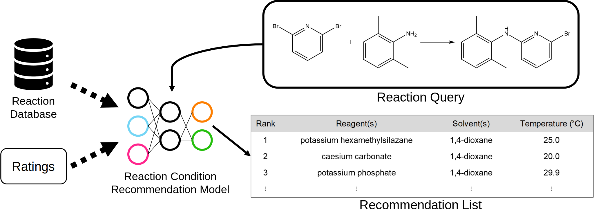

# RxnYieldContext
This is the respository of "Enhancing chemical synthesis: a two-stage deep neural network for predicting feasible reaction conditions."
https://link.springer.com/article/10.1186/s13321-024-00805-4



This is the reaction context recommendation system for multiple reaction conditions prediction.

The manuscript of this repository is in progress.

## Installation
1. `git clone https://github.com/Lung-Yi/rxn_yield_context.git`
2. `cd rxn_yield_context`
3. `conda env create -f environment.yml`
4. `conda activate rxn_yield_context`

## Fast use of the trained reaction conditioin model
```
python evaluate_example.py --input_data_path paper_examples.txt
```
The command will give the results of the illustration in the paper.

## Training
### 1. Prepare the dataset
Check all the directories in ./data/reaxys_input/

All types of the reaction have their corresponding Reaction ID recoreds in the (.txt) files. Please download the reaction condition files (.xlsx) on https://www.reaxys.com/#/search/quick

### 2. Preprocess the dataset
(1)
`cd ./analyze_data`
and run the preprocess_reaxys.ipynb file

(2) convert chemical label names to smiles:
1. `cd data/reaxys_output_local/unprocessed_class`
2. `java -jar ../../../rxn_yield_context/preprocess_data/opsin-2.5.0-jar-with-dependencies.jar -osmi class_names_reagent.txt class_names_reagent_smiles.txt`
3. `java -jar ../../../rxn_yield_context/preprocess_data/opsin-2.5.0-jar-with-dependencies.jar -osmi class_names_solvent.txt class_names_solvent_smiles.txt`
(source: https://github.com/dan2097/opsin)

(3) use PubChem and ChemSpider to double check the chemical names and emerge the names and smiles:
1. `cd rxn_yield_context/preprocess_data`
2. `python emerge.py --input_dir ../../data/reaxys_output/unprocessed_class --output_dir ../../data/reaxys_output/label_processed`
3. `python manually_modify.py --target_dir ../../data/reaxys_output/label_processed`

(4) use the new label names to process all the train, validation split .txt files:
`python process_all_data.py --target_dir ../../data/reaxys_output`

## Train the first model (multi-task multi-label classification model, or candidate generation model).
1. `export PYTHONPATH="$PYTHONPATH:~/rxn_yield_context"`
2. `cd rxn_yield_context/train_multilabel`
3. 
```
python -u Multitask_train_morgan.py --activation ReLU --epochs 80 --dropout 0.2 \
    --train_path ../data/reaxys_output \
    --batch_size 128 --weight_decay 0.0001 --fpsize 4096 --radius 2 \
    --init_lr 0.0001 --max_lr 0.005 --final_lr 0.0001 --warmup_epochs 2.0 \
    --save_dir ../save_models/test_10R_first_local_10 \
    --num_last_layer 1 --num_shared_layer 1 \
    --loss Focal --gamma 3 --valid_per_epoch 5 \ 
    --hidden_share_size 1024 --hidden_reagent_size 300 --hidden_solvent_size 100
```

## Train the second model (multi-task ranking-regression model, or ranking model).
```
python -u train_LCC_relevance_listwise_unfixed_augmentation.py --batch_size 32 --epochs 80 --num_workers 0 --activation ReLU \
    --dropout 0.2 --num_fold 7 --init_lr 0.0001 --max_lr 0.007 --final_lr 0.00005 --warmup_epochs 2 \
    --cutoff_solv 0.1 --cutoff_reag 0.1 --redo_epoch 2 --num_last_layer 2 \
    --h1_size_rxn_fp 800 --h_size_solvent 100 --h_size_reagent 200 --h2_size 500 \
    --train_path ../data/reaxys_output_local \
    --save_dir ../save_models/test_10R_second_7 \
    --checkpoint_path ../save_models/test_10R_first_local_10/multitask_model_epoch-80.checkpoint
```

## Evaluate the results

```
cd rxn_yield_context/evaluate_model

C_SOLV=0.3
C_REAG=0.25
FIRST=10
SECOND=7

python -u evaluate_overall.py \
    --test_dir ../data/reaxys_output \
    --multitask_model ../save_models/test_10R_first_local_${FIRST}/multitask_model_epoch-80.checkpoint \
    --listwise_model ../save_models/test_10R_second_${SECOND}/rxn_model_relevance_listwise_morgan_epoch-80.checkpoint \
    --cutoff_solvent ${C_SOLV} --cutoff_reagent ${C_REAG} --verbose True
```

## Cite this work
If you find this research or project useful, please cite this paper:
```
@article{chen2024enhancing,
  title={Enhancing chemical synthesis: a two-stage deep neural network for predicting feasible reaction conditions},
  author={Chen, Lung-Yi and Li, Yi-Pei},
  journal={Journal of Cheminformatics},
  volume={16},
  number={1},
  pages={11},
  year={2024},
  publisher={Springer}
}
```